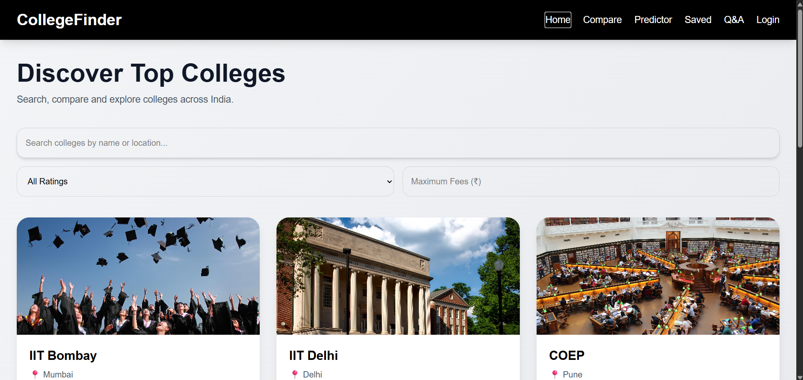
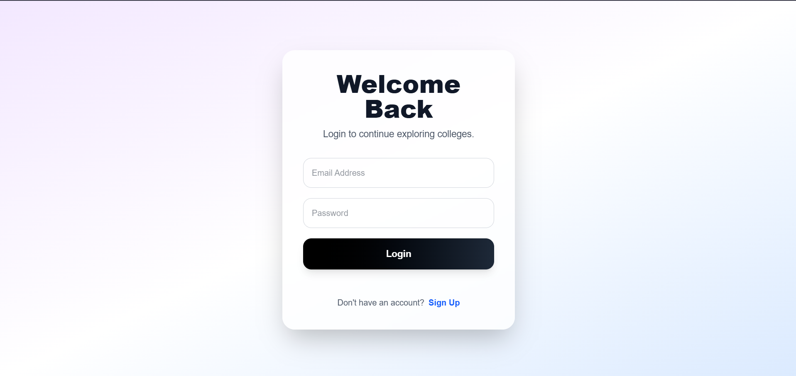
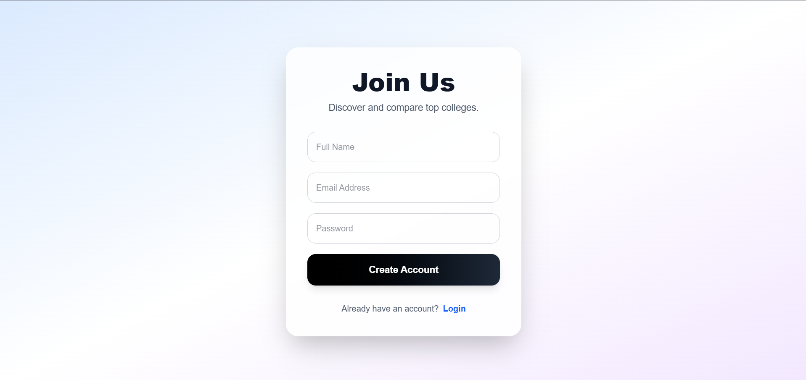
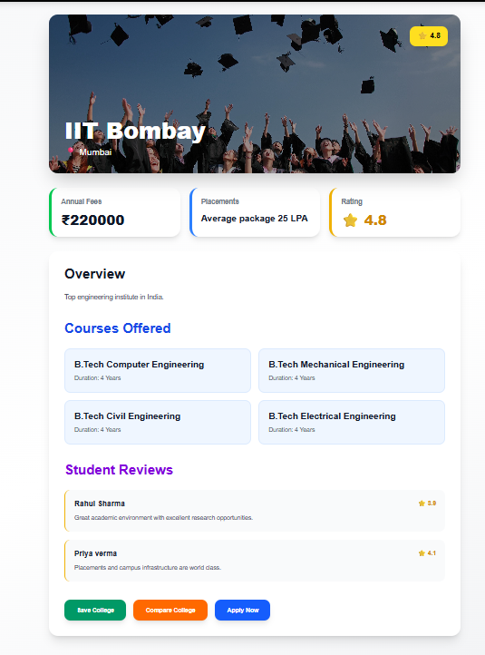
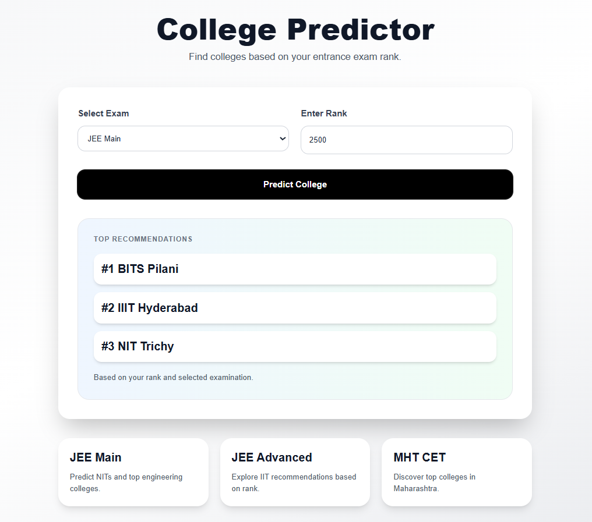
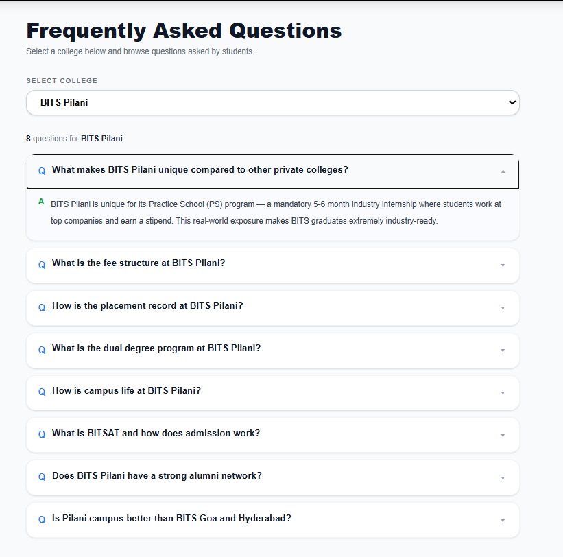

# 🎓 CollegeFinder

A modern full-stack college discovery platform that helps students explore, compare, predict, and save engineering colleges across India. Built using Next.js, Prisma, PostgreSQL, and NextAuth with a responsive, user-friendly interface.

---

## 🌐 Live Demo

**Application:** https://college-finder-git-main-rutuja-adhikar-patils-projects.vercel.app/

## 📂 GitHub Repository

**Repository:** https://github.com/Rutuja-ap/CollegeFinder

---

# ✨ Features

## 🔐 Authentication

* Secure user registration and login
* Credential-based authentication using NextAuth
* Password hashing with bcrypt
* Protected user-specific data

## 🏫 College Discovery

* Browse engineering colleges
* Detailed college information
* College overview
* Location
* Fee structure
* Ratings
* Placement statistics

## ⚖️ College Comparison

Compare colleges side-by-side based on:

* Fees
* Ratings
* Placements
* Location

## 🎯 College Predictor

Predict suitable colleges using entrance exam rank.

Currently supports:

* IIT Bombay
* IIT Delhi
* COEP
* VJTI
* BITS Pilani
* NIT Trichy
* MIT Pune
* IIIT Hyderabad
* SRM University

## ❤️ Saved Colleges

* Save favourite colleges
* Personalized dashboard
* Quick access to shortlisted colleges

## ❓ College Q&A

* College-specific frequently asked questions
* Expandable answers
* Easy navigation

## 📱 Responsive Design

* Mobile-friendly UI
* Tablet support
* Desktop optimized
* Built with Tailwind CSS

---

# 🛠 Tech Stack

### Frontend

* Next.js
* React
* TypeScript
* Tailwind CSS

### Backend

* Next.js API Routes
* Prisma ORM

### Database

* PostgreSQL (Neon)

### Authentication

* NextAuth.js
* bcryptjs

### Deployment

* Vercel

---

# 📂 Project Structure

```text
app/
│
├── login/
├── signup/
├── compare/
├── predictor/
├── saved/
├── qa/
├── college/[id]/
│
├── api/
│   ├── register/
│   ├── colleges/
│   ├── save-college/
│   └── questions/
│
components/
lib/
prisma/
```

---

# ⚙️ Installation

## Clone Repository

```bash
git clone https://github.com/Rutuja-ap/CollegeFinder.git
cd CollegeFinder
```

## Install Dependencies

```bash
npm install
```

## Configure Environment Variables

Create a `.env` file.

| Variable        | Description             |
| --------------- | ----------------------- |
| DATABASE_URL    | PostgreSQL Database URL |
| NEXTAUTH_SECRET | NextAuth Secret Key     |
| NEXTAUTH_URL    | http://localhost:3000   |

Example:

```env
DATABASE_URL=your_database_url
NEXTAUTH_SECRET=your_secret
NEXTAUTH_URL=http://localhost:3000
```

## Generate Prisma Client

```bash
npx prisma generate
```

## Run the Project

```bash
npm run dev
```

Visit:

```
http://localhost:3000
```

---

# 🗄 Database

The application uses PostgreSQL with Prisma ORM.

### Database Models

* User
* College
* SavedCollege
* Question
* Answer

---


# 📸 Application Preview

Explore the major features of **CollegeFinder** through the screenshots below.

---

## 🏠 Home Page



---

## 🔐 User Authentication

| Login | Sign Up |
| :----: | :-----: |
|  |  |

---

## 🎓 Core Features

| College Details | College Comparison |
| :-------------: | :----------------: |
|  |  |

| College Predictor | Saved Colleges |
| :---------------: | :------------: |
|  |  |

---

## ❓ College Q&A



---

# 🚀 Future Improvements

* AI-powered college recommendations
* Advanced filtering and search
* Student reviews & ratings
* Admission cutoff analysis
* Scholarship recommendations
* Placement analytics dashboard

---

# 👩‍💻 Author

**Rutuja Patil**

GitHub: https://github.com/Rutuja-ap

LinkedIn: https://www.linkedin.com/in/rutuja-patil-603a5a293/

---

# 📄 License

This project is licensed under the MIT License.

See the **LICENSE** file for details.

---

# 🙏 Acknowledgements

This project was built as part of the **Digital Heroes Full Stack Developer Trial** and showcases a production-ready full-stack application using modern web technologies.
